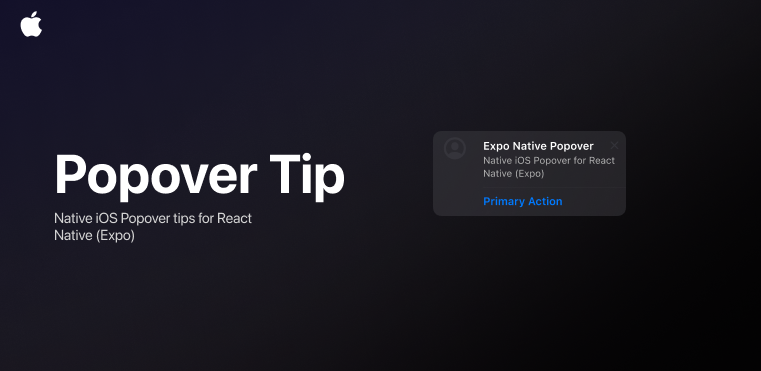

<p align="center">
  
</p>

<h1 align="center">🎯 expo-ios-popover-tip</h1>
<p align="center">
  A sleek, SwiftUI-powered popover tooltip component for React Native via Expo Modules
</p>

---

## ✨ Features

- 🍎 Powered by **SwiftUI**, ensuring native animations and rendering
- 💬 Supports **actionable tooltips** with buttons
- 🧊 Seamless glass morphism with blur and symbol support
- 🔁 Custom dismiss & tap handlers for interactive UIs
- 🧩 Nest **React Native children** inside your popover tip
- ⚡️ High performance via **Expo Modules Core**

---

## 🚀 Installation

```bash
npx expo install expo-ios-popover-tip
```

Then:

```bash
cd ios && pod install
```

> 💡 Requires Expo SDK 53+ and `expo prebuild --platform ios`

---

Great — here's how you can add a **Getting Started** section in your README that includes the `resetTips()` and `configureTips()` setup logic using `useEffect`. I’ll also include a short explanation for clarity:

---

## 🧰 Getting Started (TipKit Setup)

Before using tooltips, you must reset and configure them on app launch to ensure consistent native behavior.

```ts
import React from "react";
import { Text } from "react-native";
import { ToolTipPopoverView, resetTips, configureTips } from "expo-ios-popover-tip";

export default function App() {
  const [tipsReady, setTipsReady] = React.useState(false);

  React.useEffect(() => {
    async function setup() {
      await resetTips();       // Clears any previously shown tips
      await configureTips();   // Registers new tips for the session
      setTimeout(() => setTipsReady(true), 500); // Give the system time to register
    }
    setup();
  }, []);

  if (!tipsReady) return null;

  return (
    <ToolTipPopoverView
      tooltip={{
        id: "onboarding_tip",
        title: { text: "Welcome!" },
        description: { text: "Tap this to begin." },
        actions: [{ id: "start", title: "Let’s go!" }],
      }}
    >
      <Text style={{ padding: 10, fontSize: 16 }}>Tap Me</Text>
    </ToolTipPopoverView>
  );
}
```

> ℹ️ **Note:** You only need to call `resetTips()` and `configureTips()` **once per app session**, ideally at the root level or launch screen.

---

## 🧪 Usage

```tsx
import React from "react";
import { Text } from "react-native";
import { ToolTipPopoverView, ToolTip } from "expo-ios-popover-tip";

const tip: ToolTip = {
  id: "welcome_tip",
  title: { text: "Hello!", bold: true },
  description: { text: "This is your first popover tooltip." },
  actions: [{ id: "okay", title: "Got it" }],
};

export default function App() {
  return (
    <ToolTipPopoverView
      tooltip={tip}
      onActionPress={(action) => {
        console.log("Action tapped:", action);
      }}
      onTipDismiss={(tip) => {
        console.log("Tip dismissed:", tip);
      }}
    >
      <Text style={{ fontSize: 18, padding: 12 }}>Tap Me</Text>
    </ToolTipPopoverView>
  );
}
```

---

## ⚙️ Props

| Prop            | Type                                       | Required | Description                               |
| --------------- | ------------------------------------------ | -------- | ----------------------------------------- |
| `style`         | `StyleProp<ViewStyle>`                     | No       | Style for the container                   |
| `tooltip`       | `ToolTip`                                  | Yes      | Tooltip configuration object              |
| `children`      | `React.ReactNode`                          | Yes      | Content that triggers the popover         |
| `onActionPress` | `(actions: Actions) => void`               | No       | Callback when an action button is pressed |
| `onTipDismiss`  | `(tip: Omit<Actions, "actionId">) => void` | No       | Callback when the tip is dismissed        |

---

## 🧭 Sequential Tips (Tip Queue)

You can show multiple tips one after another using a simple queue and React state:

```tsx
import React from "react";
import { Text } from "react-native";
import {
  ToolTipPopoverView,
  resetTips,
  configureTips,
  ToolTip,
} from "expo-ios-popover-tip";

const tipQueue: ToolTip[] = [
  {
    id: "tip1",
    title: { text: "Step 1" },
    description: { text: "This is your first tip." },
    actions: [{ id: "next", title: "Next" }],
  },
  {
    id: "tip2",
    title: { text: "Step 2" },
    description: { text: "Here's what to do next." },
    actions: [{ id: "next", title: "Next" }],
  },
  {
    id: "tip3",
    title: { text: "All done!" },
    description: { text: "You're good to go." },
    actions: [{ id: "done", title: "Finish" }],
  },
];

export default function App() {
  const [tipsReady, setTipsReady] = React.useState(false);
  const [currentTipIndex, setCurrentTipIndex] = React.useState(0);

  React.useEffect(() => {
    async function setup() {
      await resetTips();
      await configureTips();
      setTimeout(() => setTipsReady(true), 500);
    }
    setup();
  }, []);

  function handleTipEvent() {
    const nextIndex = currentTipIndex + 1;
    if (nextIndex < tipQueue.length) {
      setCurrentTipIndex(nextIndex);
    }
  }

  if (!tipsReady || currentTipIndex >= tipQueue.length) return null;

  return (
    <ToolTipPopoverView
      key={`tip-${tipQueue[currentTipIndex].id}`} // Ensures the view updates
      tooltip={tipQueue[currentTipIndex]}
      onActionPress={handleTipEvent}
      onTipDismiss={handleTipEvent}
    >
      <Text style={{ padding: 12, fontSize: 16 }}>
        Show Tip {currentTipIndex + 1}
      </Text>
    </ToolTipPopoverView>
  );
}
```

> ⚠️ **Requires iOS 26 + Xcode 15.4 beta** for displaying multiple popover tips in one session.
> Otherwise, only one tip will be shown by iOS system constraints.

---

## 🧩 Tooltip Object

```ts
export interface ToolTip {
  id: string;
  title: Title;
  image?: Image;
  description?: Description;
  actions?: TipActions[];
}

export interface TipActions {
  id: string;
  title: string;
}

export interface Title {
  text: string;
  foregroundColor?: string;
  size?: number;
  bold?: boolean;
}

export interface Description {
  text: string;
  foregroundColor?: string;
  size?: number;
  bold?: boolean;
}

export interface Image {
  systemName?: string; // e.g., "sparkles" (SF Symbols)
}
```

---

## 💡 Customization

You can customize:

- ✅ Title & description styles
- ✅ SF Symbols image
- ✅ Multiple actions
- ✅ Dismiss callback
- ✅ Native tap handling

---

## 📱 Platform Support

- ✅ iOS (SwiftUI)
- ❌ Android (not supported)

> ⚠️ **Requires iOS 17+** for `TipKit` support
> ⚠️ **iOS 26 + Xcode 15.4+ beta** required for **multiple popover tips**

---

## 🔧 Built With

- 🛠 [Expo Modules](https://docs.expo.dev/modules/overview/)
- 🍎 [SwiftUI](https://developer.apple.com/documentation/swiftui/)
- ⚛️ [React Native](https://reactnative.dev/)

---

## 🎥 Demo


https://github.com/user-attachments/assets/c2b0e8cf-0814-40f2-b36a-66825313a6df


---

## ❤️ Contributing

Pull requests and feedback are warmly welcome!
Let’s push the limits of native + React Native.

---

## 📄 License

MIT © [rit3zh](https://github.com/rit3zh)
